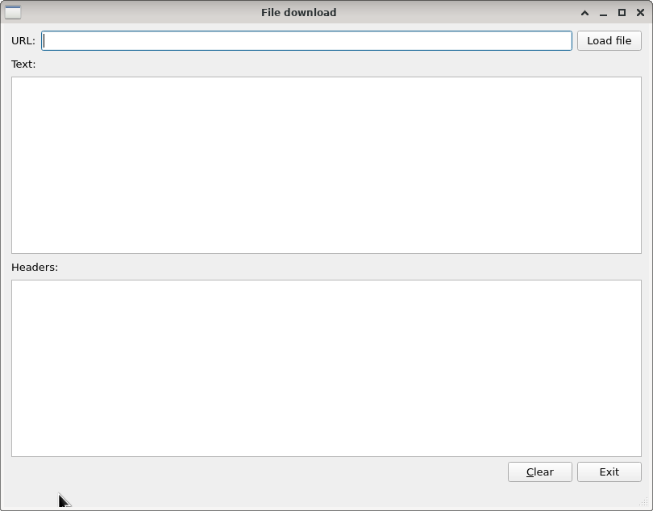
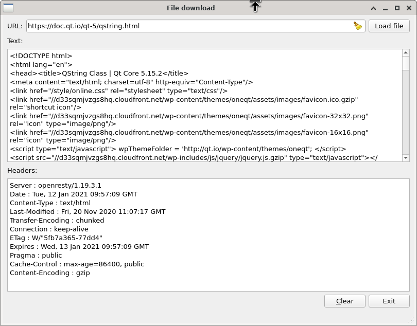
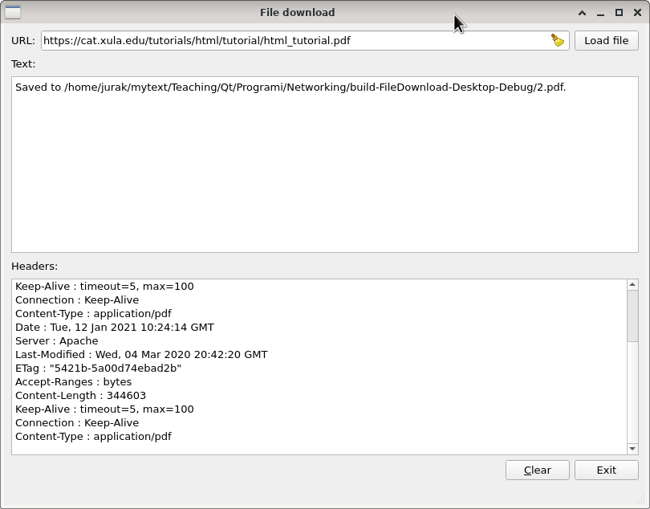
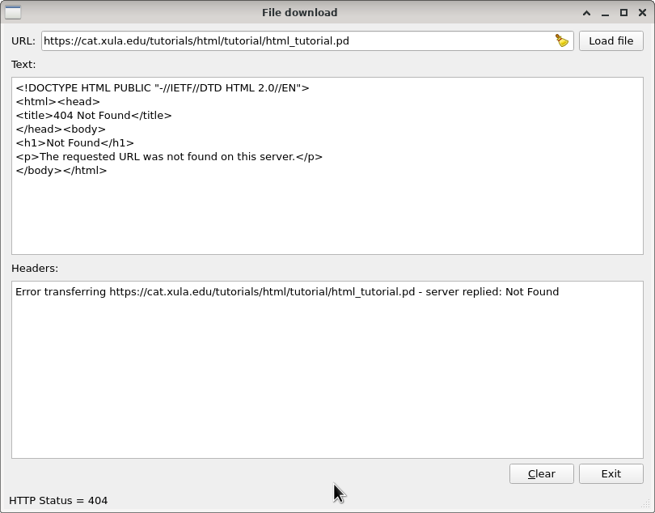
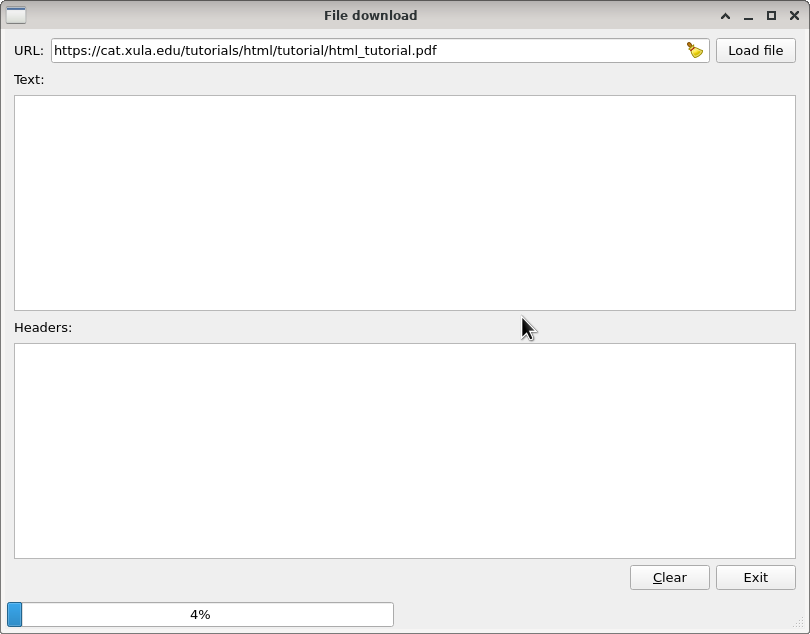
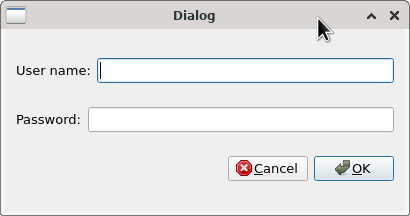

**Zadatak**.  Potrebno je napraviti aplikaciju za preuzimanje datoteka 
s interneta. Nakon pokretanja aplikacija ima sljedeći oblik:

U centru aplikacije se nalaze dva objekta tipa `QPlainTextEdit`. U gornjem
prikazujemo datoteku, a u donjem sva zaglavlja koja je server poslao.

Aplikacija preuzima datoteke s interneta. Ako datoteka ima tekstualni
mime tip onda se prikazuje u gornjem  `QPlainTextEdit` elementu. U donjem
se za svaki tip datoteke ispisuju  sva zaglavlja koja je server poslao.

Nakon unosa adrese u URL `QLineEdit` i pritiskom na "Load file" dugme
dobivamo sljedeći prikaz:

Ukoliko MIME tip datoteke (vidi `QNetworkRequest::ContentTypeHeader`)
nije tekstualni onda se otvara _File Dialog_ i preuzimanje se smješta u 
odabranu datoteku. Zglavlja se normalno ispisuju, a u gornji 
 `QPlainTextEdit` ispisujemo samo stazu u koju je datoteka spremljena.

Svo preuzimanje se vrši tako da se sadržaj preuzima u privremenu datoteku. 
Ta se datoteka zatim ispisuje u  `QPlainTextEdit` grafičkom elementu 
ili se kopira u odabranu datoteku. Za generiranje imena privremene datoteke 
koristiti klasu `QTemporaryFile`, a za kopiranje datoteke koristiti 
klasu `QDir`.

**Greške** se tretiraju tako da se tekst greške ispiše u donjem 
 `QPlainTextEdit` grafičkom elementu, a kod greške se stavi u 
statusnu traku. Ako je server vratio stranicu s opisom greške (što je uobičajeno)
ona se prikazuje u gornjem  `QPlainTextEdit` grafičkom elementu. 

**Progres**: 
U statusnoj traci za vrijeme preuzimanja treba prikazivati `QProgressBar`
grafički element:

**Autentifikacija**:
Ukoliko stranica koju preuzimamo traži autentifikaciju, onda treba otvoriti 
dijalog za unos korisničkog imena i zaporke (koristiti signal 
`QNetworkAccessManager::authenticationRequired`):

 

Zaporka se naravno ne smije prikazivati prilikom tipkanja. 

Dugme "Clear" čisti oba editora; oba editora moraju biti u _read only_ načinu rada.

Sve ostale detalje koji ovdje eventualno nisu spomenuti napraviti po vlastitom 
nahođenju. 
