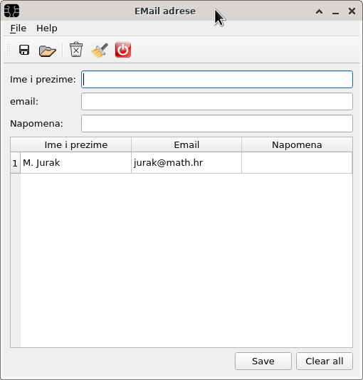
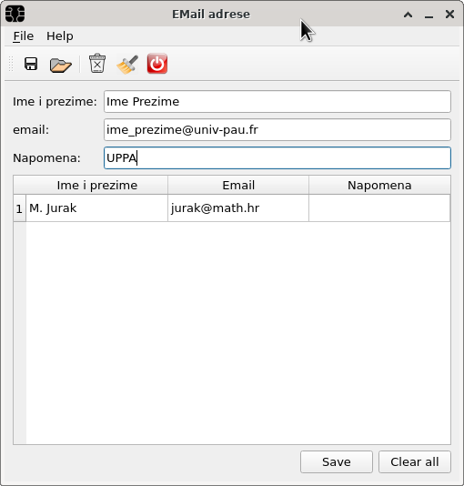
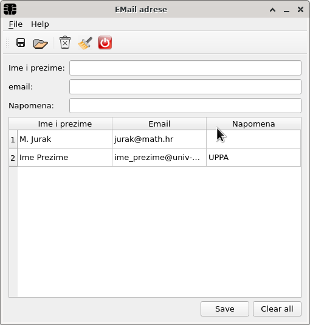
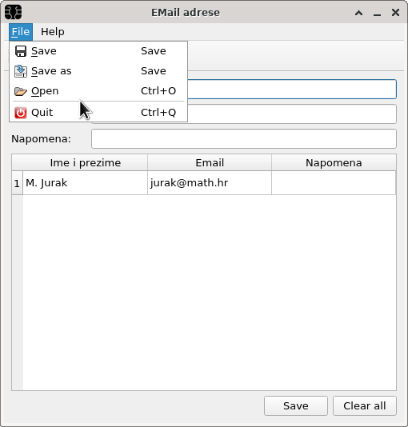
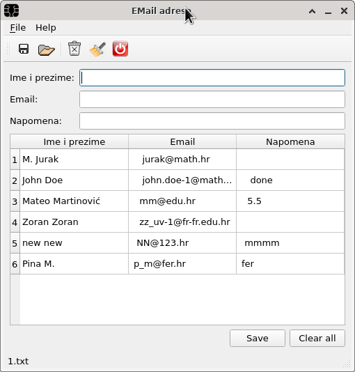

**Zadatak**. Potrebno je doraditi zadatak s predavanja. Pri tome će trebati 
napraviti manje dorade i manje izmjene. 

Aplikacija ima sljedeće sučelje:

 

**Funkcionalnost**. Središnji panel predstavlja tabelu kontakata. Inicijalno 
tabela može biti prazna ili u njoj može biti jedan redak s podacima (na primjer vaša
email adresa). Tabela **ne smije dozvoljavati editiranje** od strane korisnika. 
Dozvoljen je samo unos podataka iz gornja tri polja ("Ime i prezime", "Email" i
"Napomena"). 

Unosom podataka u gornju formu kao na ovoj slici

 

i pritiskom na dugme **Save** podaci se dodaju u centralnu tabelu podataka i brišu iz gornje forme za unos:

 

Dugme **Clear All** briše sve podatke iz table (i iz pripadnog modela). 

Kod unosa podataka u tri polja potrebno je osigurati sljedeće: podaci u 
poljima "Ime i prezime" i "Napomena" **ne smiju sadržavati zarez**. 
Podatak u polju "Email" mora biti **regularna email adresa**. Za implementaciju ćete morati 
koristiti  metodu `QLineEdit::setValidator()` te klase 
`QRegularExpression` i  `QRegularExpressionValidator`.

**Funkcionalnost izbornika**: Izbornik **File** ima sljedeće stavke:

 

Kada se klikne na **Open** stavku poziva se _File Open Dialog_ 
(statička metoda `QFileDialog::getOpenFileName()`) i selektira se datoteka koja će biti 
otvorena.  _File Open Dialog_ mora filtrirati datoteke tako da prikazuje samo datoteke s 
ekstenzijom **.txt**. Datoteka će tada biti učitana i centralna tabela će biti 
popunjena njenim podacima. U **statusnoj traci** će se pojaviti ime datoteke bez staze. Na primjer,
nakon učitavanja datoteke **1.txt** (iz direktorija aplikacije) dobivamo:

 
 

Ukoliko se prilikom otvaranja datoteke u aplikaciji već nalaze podaci iz neke druge datoteke 
oni se prvo moraju upisati u svoju datoteku kako bi eventualne promjene bile spremljene. Pri tome 
trebate pitati korisnika želi li spremiti promjene ako su podaci mijenjni, ali ne ako nisu.

**Struktura datoteke**. 
Podaci se pamte u tekstualnoj datoteci tako da je svaki redak tabele u jednom retku datoteke, a polja su 
odvojena zarezima. To je razlog zašto se zarezi ne smiju unositi u polja.

   
Stavka **Save as** otvara  _File Open Dialog_ kako bi se odabralo ime nove datoteke u koju će 
podaci biti spremljeni. Nakon spremanja u statusnoj traci se pojavljuje ime odabrane datoteke.  
 
Stavka **Save** sprema podatke u datoteku iz koje su pročitani i to samo ako su u međuvremenu mijenjani. 
Ako podaci nisu uzeti iz datoteke (što je slučaj nakon pokretanja programa) poziv se preusmjerava na **Save as**
funkciju. 

Stavka **Quit** završava aplikaciju. 

Izbornik **Help** ima samo **About** stavku koja daje poruku o aplikaciji (po vašem izboru).

**Alatna traka**. U alatnoj traci se nalaze redom sljedeće akcije: **Save**, **Open**, **Delete**,
**Delete all** i **Quit**. **Save**, **Open** i **Quit** su iz **File** izbornika, **Delete all**
ima istu funkciju kao i  **Clear All** dugme.  **Delete** koristi `QInputDialog` za unos retka 
kojeg treba izbrisati te ga nakon pritiska na Ok dugme briše. 

**Napomena**. Za rada sa novim klasama koje se pojavljuju u programu treba pogledati dokumentaciju 
biblioteke.  Kako biste postavili ime datoteke u statusnu traku kada se učita nova datoteka 
potrebno je pri svakoj promjeni datoteke koja se prikazuje emitirati signal koji će ime 
datoteke imati kao argument. Taj će signal trebati povezati sa metodom `QStatusBar::showMessage()`.
Posjetimo se da se signal  samo deklarira dok implementaciju vrši MOC. Kod emitiranja signala
signal se jedostavno pozove s argumentom koji želimo prenijeti utoru. Dobra je praksa prije imena
signala staviti **emit** (na primjer `emit mojSignal("ime");`). **emit** je makro koji se 
ekspandira kao _ništa_ i stoga nema nikakvog utjecaja na izvršavanje programa te služi samo za dokumentaciju programa. 
