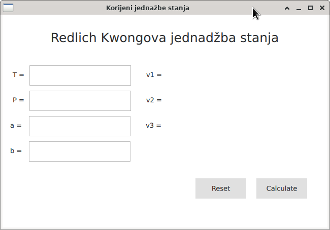
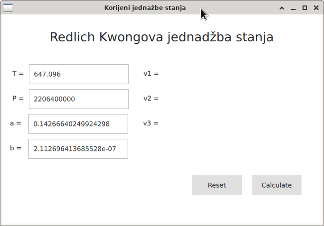
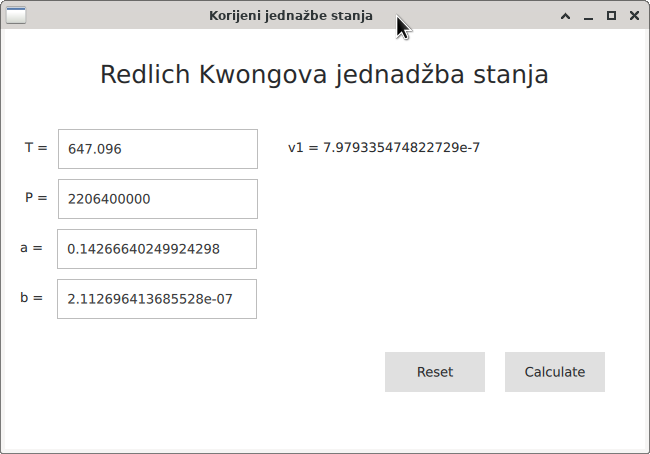
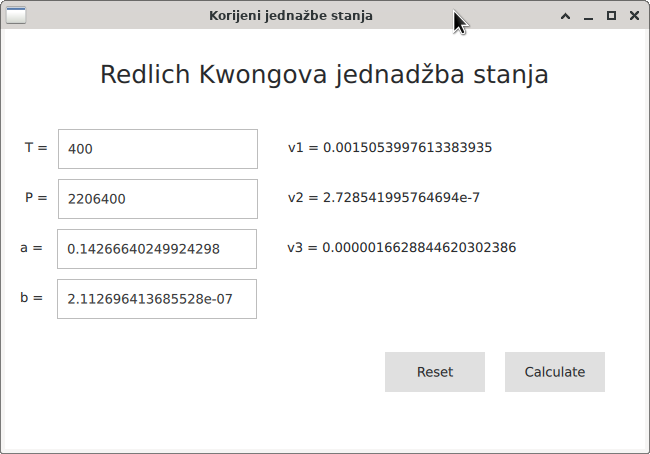

**Zadatak**. Potrebno je izraditi aplikacju koja računa 
volumen fluida pri zadanom tlaku i temperaturi prema 
Redlich Kwongovoj jednadžbi stanja (_equation of state_).

Redlich Kwongova jednadžba daje tlak u ovisnosti o volumenu 
i temperaturi:

- T je apsolutna temperatura [K]
- P je tlak [Pa]
- R je plinska konstanta = 8.314462  J/(Kmol)
- a je konstanta (a >=0, korekcija privlačnog potencijala molekula)
- b je konstanta (b>=0, korekcija volumena)
- v je volumen (jednog mola supstance) [m^3]

Zadatak je za zadane T,P,a,b izračunati v (R je konstanta). 
Kada se raspiše jednadžba za v vidi se da se radi o polinomijalnoj 
jednadžbi trećeg stupnja koja ima jedno ili tri realna rješenja. 
Fizikalno značenje (volumena) imaju samo realna rješenja. 

Kada postoji samo jedno rješenje, onda je supstanca u jednom agregatnom 
stanju, plinovitom ili tekućem. Ako postoji tri rješenja onda je 
tekuća supstanca u ravnoteži sa svojim parama i volumen može biti 
bio koji između minimalnog i maksimalnog korijena jednadžbe. 

Grafičko sučelje ima slijedeću formu:

Stiskom na dugme "Reset" dobivamo određene "defaultne vrijednosti" (uzmite nešto 
slično). 

Pritiskom na tipku "Calculate" izračunaju se tražene nultočke. 
Ispisuju se samo realne nultočke kojih može biti jedna ili tri. 
Ako postoji samo jedna, onda se ona ispisuje u `v1`, a labele
`v2` i `v3` nestaju. Na primjer, defaultne vrijednosti vode na:

Kada unesemo podatke koji daju 3 nultočke dobivamo ispis svih 
nultočki. 

**Implementacija**. 

- Sučelje implementiramo u QML-u.
- Račun nultočki treba biti napravljen u C++-u. 
- Tranzicija između dva stanja (ono s jednim i sa tri ispisa)
   treba biti postupna.
- Za detekciju i računanje realnih korijena kubne jednadžbe 
  koristiti Cardanovu metodu.
  Algoritam je opisan, na primjer, u PDF datoteci u `doc` direktoriju.

