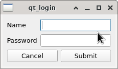

**Zadatak**. Potrebno je napraviti malu login aplikaciju. 
Aplikacija otvara sljedeći prozor:

Aplikacija završava ako se klikne na "Cancel". Kada se klikne na "Submit"
provjerava se da li su uneseni podaci jednaki podacima koji su 
zapisani u aplikaciji (možete ime i zaporku zadati u konstruktoru). 
Pri tome zaporka ne smije biti prikazana:

Ako podaci nisu pogođeni daje se obavijest o tome: 

i očekuje se novi upis. Polja za unos moraju biti očišćena. 

Ako su podaci pogođeni javlja se obavijest:

i nakon potvrde (klik na ok) program završava.  
