**Zadatak.**
Potrebno je napraviti klijent-server aplikaciju za izmjenu tekstualni poruka.

**Server**

Grafičko sučelje servera nakon pokretanja prikazano je na ovoj slici:

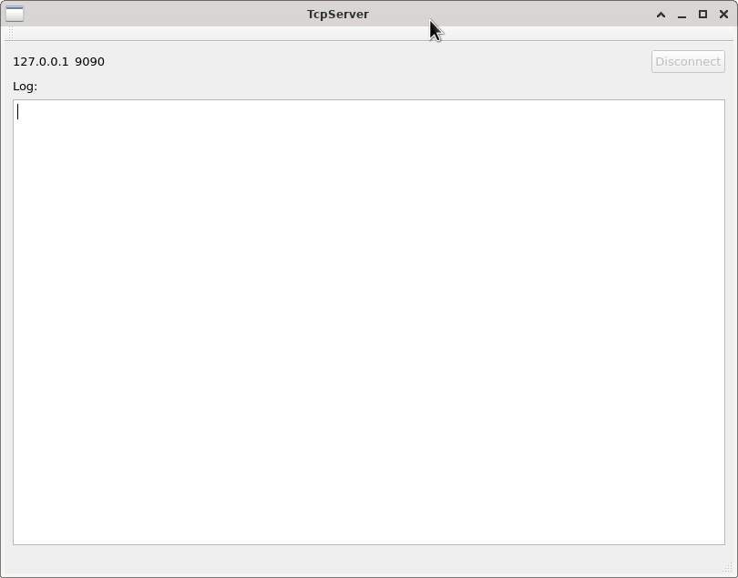

U gornjem dijelu sučelje ima dvije labele i "Disconnect" dugme koje služi za prekid svih 
uspostavljenih veza. Dok niti jedna veza nije uspostavljena dugme je onemogućeno,
a čim postoji barem jedna veze omogućava se. Dvije labele u istoj razini daju 
adresu na kojoj se server nalazi i port na kojem server sluša. Server neka je pokrenut 
na lokalnom stroju (127.0.0.1) jer ćemo ga testirati samo s lokalnog stroja. 

Ispod labele "Log:" nalazi se `QPlainTextEdit` u koji će biti logirane poruke.

**Klijent**

Grafičko sučelje klijenta nakon pokretanja prikazano je na ovoj slici:

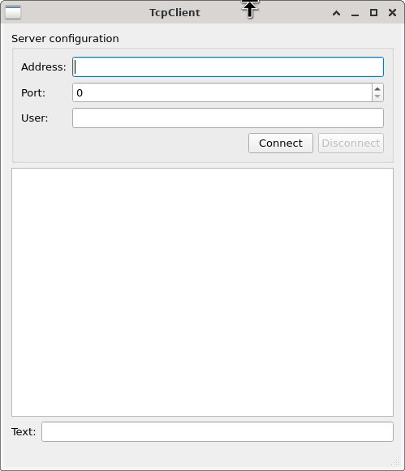

U gornjem dijelu sučelja nalaze se podaci za konfiguraciju servera.
Tu imamo dva `QLineEdit` elementa za adresu servera i ime korisnika te jedan 
`QSpinBox` za unos broja porta. Konačno, u istoj cjelini je dugmad 
"Connect" i "Disconnect". Cijela se grupa nalazi u jednom `QGroupBox` elementu. 
U srednjem dijelu je `QTextEdit` element za prikaz poruka. Konačno,
na dnu je  `QLineEdit` element za unos poruke. 

Nakon što je konekcija ostvarena imamo ovu sliku:

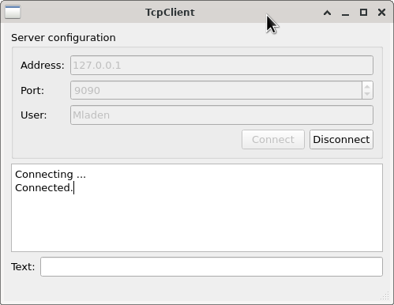

Dok je konekcija aktivna onemogućen je unos nove konfiguracije servera. Moguće je 
samo napraviti dekonekciju. Nakon prekida veze ponovo se omogućava unos podataka 
o serveru (i korisniku), "Disconnect" dugme se onemogućuje, a "Connect" se omogućuje.
Server pri tome logira konekciju:

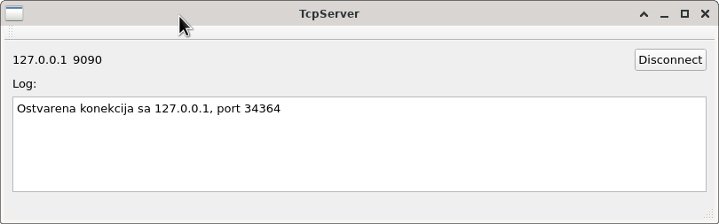

Kada se tekstualna poruka upiše u "Text:" ne dešava se ništa sve dok se ne stisne Enter
(vidi sliku).

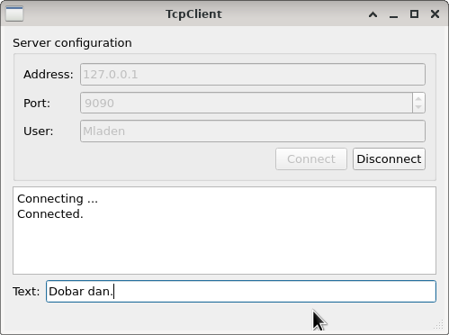
 
Nakon pritiska na Enter poruka se logira u klijentu i šalje serveru.

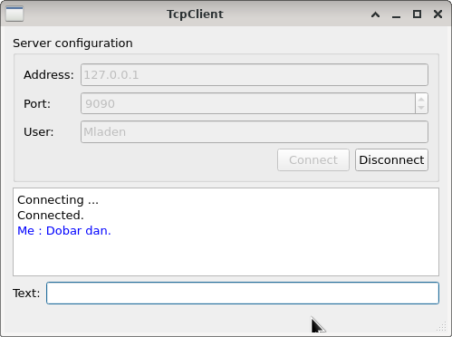

Uočimo da je poruka logirana plavom bojom i da je izbrisana iz "Text:" polja.
Server logira poruku s imenom pošiljaoca

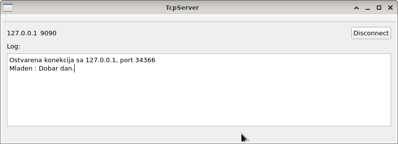

i šalje ju svim ostalim klijentima. Sa dva klijenta mogli bismo imati ovu situaciju:

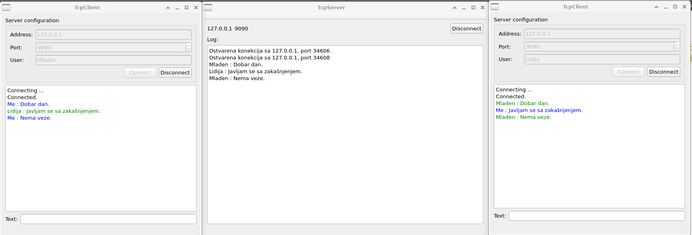

Uočimo da su u klijentu poruke drugih u drugoj boji (zelenoj) i da im prethodi ime pošiljaoca.
Radi lakog korištenja boja u klijent koristimo `QTextEdit` umjesto `QPlainTextEdit` elementa. 

**Protokol**

Klijent i server šalju tekstualne poruke UTF-8 kodirane čiji kraj označava znak s kodom 23.
Nakon što server prihvati konekciju on šalje specijalnu poruku klijentu kojom ga traži da 
pošalje korisničko ime. Server će zatim to korisničko ime zapamtiti i koristiti kod 
prosljeđivanja poruka koje dolaze s klijentovog _socketa_. Klijent je na zahtjev servera 
dužan odmah odgovorit s imenom iz svog User polja. 

**Dekonekcija i greške**

Kada se klijent odspoji i klijent i server to logiraju. 

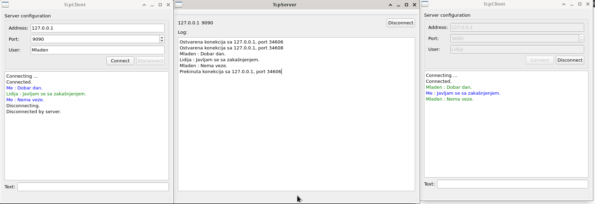

Kada na serveru stisnemo dugme "Disconnect" prekidaju se sve još postojeće veze. 
To će biti logirano i kod servera i kod klijenta. 

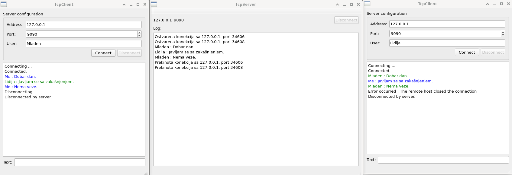

Kada se klijent ne uspije spojiti to mora logirati. Na primjer:

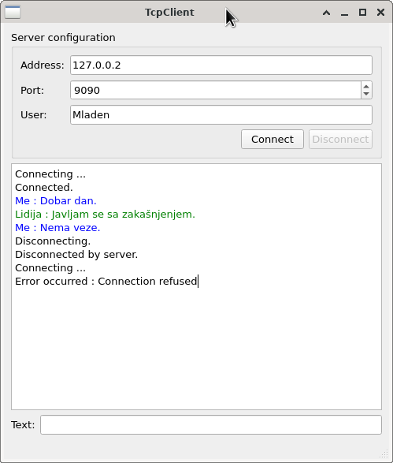

Sve detalje aplikacije koji ovdje eventualno nisu spomenuti dopunite sami.

